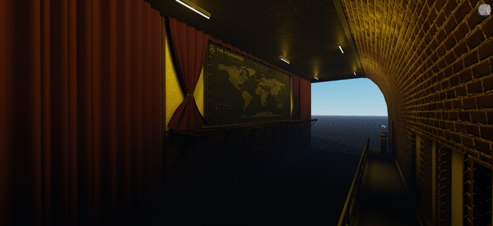
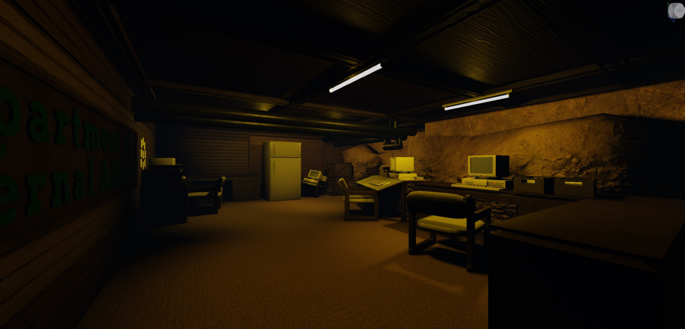
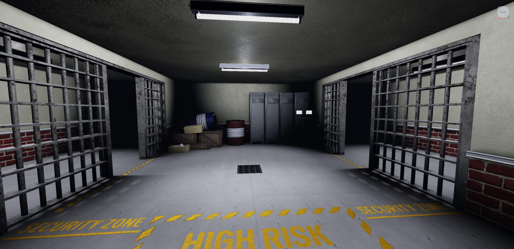

# Building Progress

A showcase of my environment design and building work.

## August 2026

### Alpine — Facility Area

My current work on Alpine, focused on creating an atmospheric industrial facility environment.

## What I Worked On

- Facility environment design
- Catwalks and industrial architecture
- Interior facility spaces
- Custom materials and textures
- Lighting and atmosphere
- Security and restricted-access areas

## Screenshots

### Foundation Hallway

---

### Office Room

---

### Security Zone

---

## About the Project

Alpine is an environment-building project focused on creating detailed facility interiors with an industrial and secure atmosphere.

This repository documents my progress as I continue designing, building, lighting, and improving the environment.

## Progress

**Status:** Work in progress

More updates and screenshots will be added as development continues.
